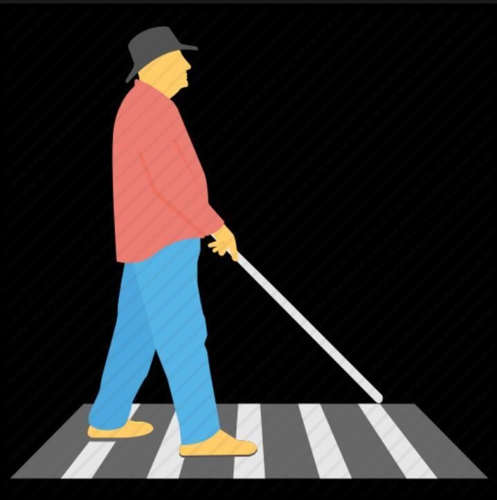
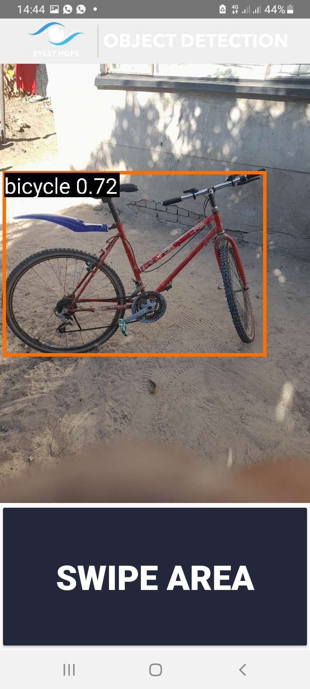

# Blind Assistant Application : Eyesy Hope Version 1
#An android application for blind people which implements object detection and face recognition as core features

.

# Technologies
- Natural Language Processing (NLP)
- Computer Vission

# Object detection
## YOLO (You Only Look Once) Algorithm was used.

## Why YOLO?

- YOLO (You Only Look Once) is a real-time object detection system that has gained popularity in computer vision applications. The main advantage of YOLO over other object detection systems is its speed. YOLO is able to detect objects in an image in real-time, meaning that it can process frames from a video stream at a rate of several frames per second.
- Another advantage of YOLO is its accuracy. YOLO is able to detect objects with a high degree of accuracy, even in cases where the objects are partially occluded or have low contrast with the background.
- YOLO also has a relatively simple architecture compared to other object detection systems, making it easier to implement and train. This simplicity allows YOLO to be used on resource-constrained devices like smartphones and embedded systems.
- Overall, YOLO's combination of speed, accuracy, and simplicity has made it a popular choice for real-time object detection in a variety of applications, including autonomous vehicles, surveillance systems, and robotics.

# Face Recognition
## OpenCV library was used in conjuction with CNN (Convolutionary Neural Networks) 
- CNNs are a type of deep learning algorithm that have shown impressive results in face recognition. CNNs can be trained on large datasets of faces to learn features automatically and can achieve high accuracy in face recognition tasks.

# Natural Language Processing 
## Natural Language Processing was used for allowing the blind person to navigate through the system using voice commands
- Google Text To Speech was used to convert voice input to text

# Aims Of the Project
- This research aims to design and implement a blind Assistant application using YOLO machine learning algorithm.

# Objectives

- To identify an appropriate dataset for the model
- To train the virtual blind assistant machine learning model and test the model
- To implement YOLO Machine learning algorithm to detect objects within 1m - 10m of range using TensorFlow
- To implement Convolutional Neural Networks (CNN) for face recognition using OpenCV.
- To implement Geo-Decoder an android class to locate the blind person at any time using GPS coordinates

# Tools used

- Database: SQLite
- Environment Variables: Android SDK , JDK
- Programming Languages: Kotlin, Java and Python
- Algorithms: YOLO and CNN
- Android Packaging Tool: Gradle
- Architecture: SSD Mobile Net
- Libraries: TensorFlow, OpenCV
- IDE: Android studio, Jupiter Notebook

# System Images 

## Object Detection

.

  

